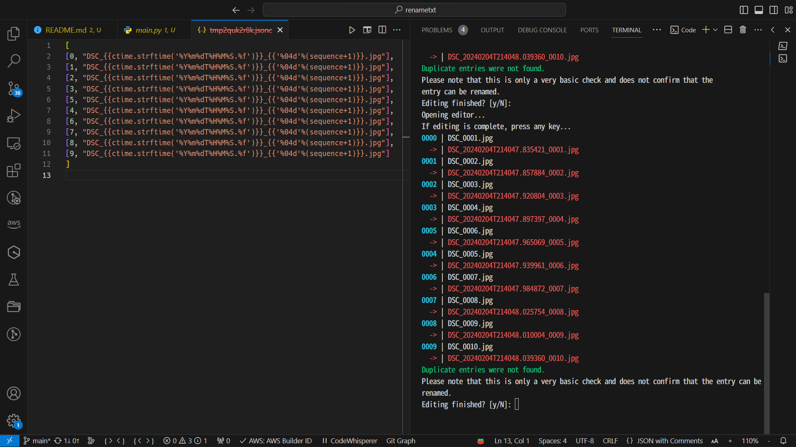

# rename.txt: 一個基於文字的檔案重新命名工具

[English](./README.md) | 正體中文

`rename.txt` 讓你使用最喜歡的文字編輯器批次修改檔案名稱。

> :warning: 這是一個預發佈版本，尚未完全測試。
> 請不要在生產環境中使用，並務必進行備份。

## 簡介



## 功能

- 使用你最喜歡的文字編輯器批次修改檔案／資料夾名稱；
- 透過模板引擎 [jinja2] 支援變數；
- 透過附加元件支援更多變數；
- 預覽、多次修改；
- 生成一個不太有用的日誌檔，如果有問題發生，這可能會派上用場。

[jinja2]: https://palletsprojects.com/p/jinja/

## 使用方法

使用方法: renametxt.py [OPTIONS] [PATH]...

選項：

- `--debug`: 除錯模式，輸出更多訊息。
- `-d, --dryrun`: 測試模式：測試程式碼，而不實際執行實際功能。 [預設: True]
- `-o, --output FILE`: 恢復日誌檔案的輸出路徑。 [預設: `./YYYYMMDDTHHMMSS.rename.json`]
- `-h, --help`: 顯示此訊息並退出。

提示：對於 Windows 使用者，將檔案拖曳到 `renametxt.bat` 圖示上，可快速使用指令。

### 步驟

1. 匯入需要重新命名的檔案和資料夾作為引數。
   請注意，引數中的檔案順序將被用作索引號 (`index`，從 0 開始)；
2. 程式將生成一個臨時檔案，我們稱之為 <u>條目檔案</u>，並使用預設的文字編輯器打開它；
3. 編輯條目檔案並保存它；然後返回程式，按任意鍵繼續並預覽編輯的結果。
   請注意，條目的順序將遵循序號 (`sequence`，從 0 開始)；
4. 檢查編輯的結果並選擇重新編輯或開始重新命名。
5. 程式生成一個恢復記錄並開始重新命名。

### 條目檔案

條目檔案是一個 JSON 檔案，它是一個列表，每個條目都包含 `index` 號和檔案名稱。看起來像這樣：

```json
[
  [0, "foo.txt"],
  [1, "bar.jpg"]
]
```

提示：現代編輯器有多行編輯功能。

提示：通過修改 `index` 號，可以實現交換檔案名稱的效果。

### 變數

在修改名稱時，可以使用模板中的變數。
變數是基於每個項目及其元數據生成的。

以下是一些預設的變數：

- `self`: `pathlib.Path`，項目的路徑。
- `index`: 整數，項目在引數中的順序。
- `sequence`: 整數，項目在 `條目檔案` 中的順序。
- `size`: 整數，檔案大小（位元組）。對於資料夾為 `0`。
- `atime`, `mtime`, `ctime`: `datetime.datetime`，項目的存取、修改和創建時間。
- `naturalsize.size`: 可讀的檔案大小，例如 `8.7 KiB`。

變數的使用基於模板引擎 [jinja2]，
這使我們在使用變數時可以進行一些簡單的操作和格式化。

```json
[
  [0, "DSC_{{ mtime.strftime('%Y%m%dT%H%M%S') }}_{{ '%04d' % (index+1) }}.JPG"],
  [1, "DSC_{{ mtime.strftime('%Y%m%dT%H%M%S') }}_{{ '%04d' % (index+1) }}.JPG"]
]
```

呈現後的檔名將為：

```log
0000 | DSC_0094.JPG
  -> | DSC_20210315T000649_0001.JPG
0001 | DSC_0087.JPG
  -> | DSC_20220320T103149_0002.JPG
```

## 雜項

### 為什麼要進行兩步驟的重新命名？

這是一種貪婪的方法，以避免交換兩個檔案名稱時的碰撞。

c=a; a=b; b=c;

臨時檔案名稱使用 UUID 以避免碰撞。

